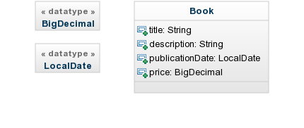
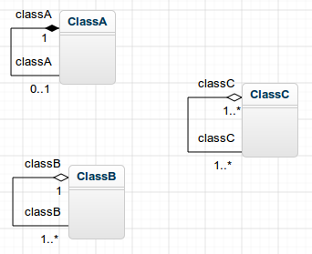
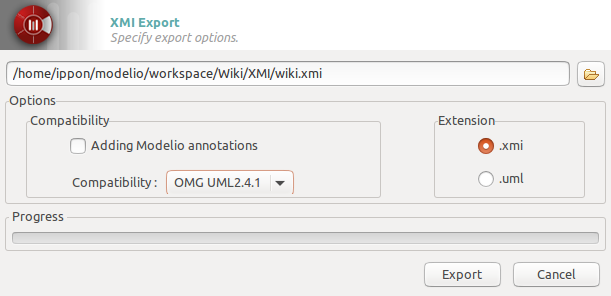
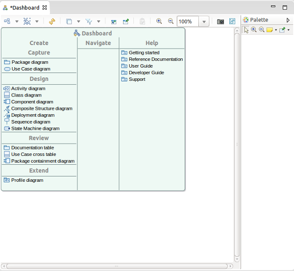
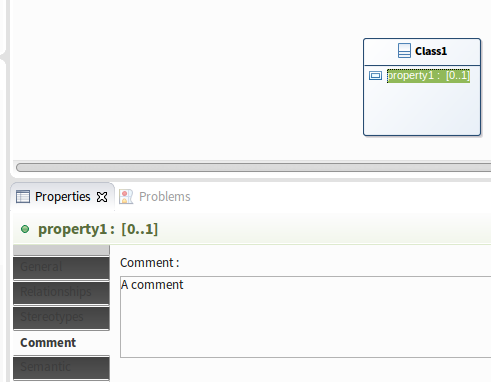
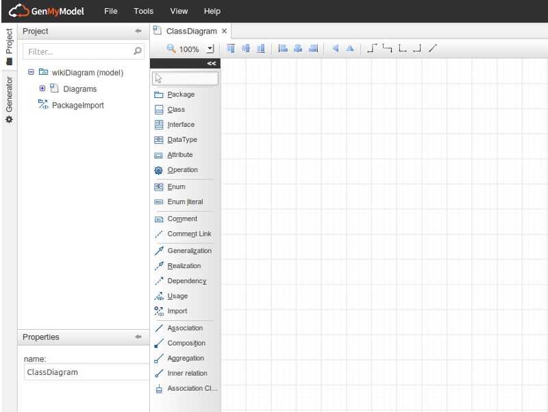
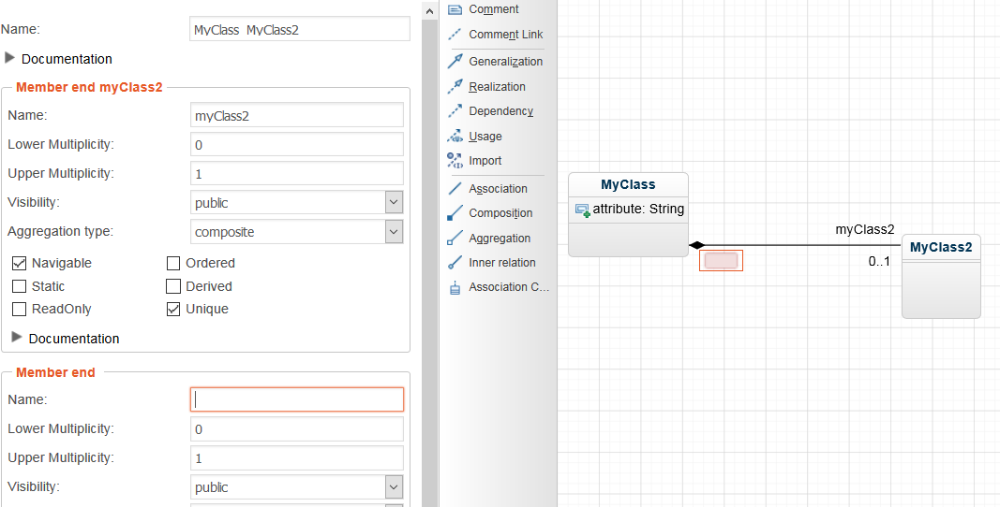
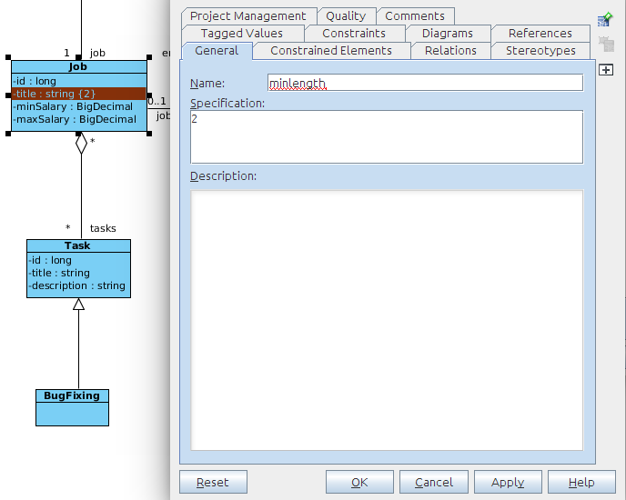
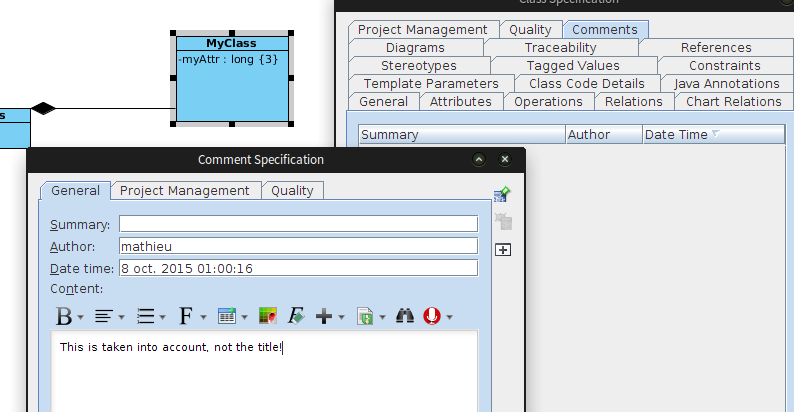

# <i class="fa fa-magic"></i> JHipster-UML

JHipster-UML is a JHipster sub-project which can be used as a replacement to using the [entity sub-generator]({{ site.url }}/creating_an_entity.html). The idea is that it is much easier to [manage relationships]({{ site.url }}/managing_relationships.html) using a visual tool than with the classical Yeoman questions and answers.

The JHipster-UML project is [available on Github](https://github.com/jhipster/jhipster-uml), it is an Open Source project like JHipster (Apache 2.0 licence). If you like this project, don't forget to give us a star on Github!

Here's what's covered on this page:

1. [Introduction](#introduction)
2. [Issues and bugs](#issues)
3. [Installation](#install)
4. [How to use JHipster-UML](#howtouse)  
    4.1. [The UML file](#umlfile)  
    4.2. [Use JHipster-UML](#usejuml)  
    4.3. [What's generated](#whatsgenerated)  
5. [Examples](#examples)  
    5.1. [Modelio](#modelioexample)  
    5.2. [UML Designer](#umldesignerexample)  
    5.3. [GenMyModel](#genmymodelexample)  
    5.4. [Visual Paradigm](#visualparadigmexample)  
6. [Testing](#testing-juml)
7. [Contributing: issues and enhancements](#contributing)  
    7.1. [Parser modifications](#parsermodifications)  
8. [JDL - JHipster Domain Language](#jdl)  
    8.1. [The language](#jdllanguage)  
    8.2. [How to use it](#howtojdl)  
    8.3. [Commenting](#commentingjdl)  
9. [Annexes](#annexes)

***

# Introduction

JHipster-UML is an alternative to the usual Q&A as it offers you the possibility to use a UML editor to create a diagram that will be parsed by JHipster-UML.

Here is a list of the editors we support:

  - [Modelio](https://www.modeliosoft.com/);
  - [UML Designer](http://www.umldesigner.org/);
  - [GenMyModel](https://www.genmymodel.com/) (not free);
  - [Visual Paradigm](http://www.visual-paradigm.com/) (not free, but proposes a community edition).

***

# Issues and bugs

JHipster-UML is [available on Github](https://github.com/jhipster/jhipster-uml), and follows the same [contributing guidelines as JHipster]( https://github.com/jhipster/generator-jhipster/blob/master/CONTRIBUTING.md).

Please use our project for submitting issues and Pull Requests:

- [JHipster-UML issue tracker](https://github.com/jhipster/jhipster-uml/issues)
- [JHipster-UML Pull Requests](https://github.com/jhipster/jhipster-uml/pulls)

Please note that using JHipster-UML (or JHipster) might be troublesome (one has to install some tools to really be able to use the Node environment without any issue). This [link](https://gist.github.com/nullivex/7115612) may help if you encounter an issue on Windows.

Another issue that can be encountered on windows is [this one](https://stackoverflow.com/questions/30344858/node-script-executable-not-working-on-mac-env-node-r-no-such-file-or-directo#answer-30349952). The link provides a solution to fix that.

***

# Installation
To install JHipster-uml simply use the command:

 `npm install -g jhipster-uml`

If you want the 'bleeding edge' version, you can clone our git repo from [our Github project](https://github.com/jhipster/jhipster-uml):

  `git clone https://github.com/jhipster/jhipster-uml.git` for HTTPS

  `git clone git@github.com:jhipster/jhipster-uml.git` for SSH

***

# How to use it
JHipster-UML is quite easy to use, you need a class diagram exported in XMI and JHipster-UML will parse it to create your entities.

## The UML file

The class diagram should modelize the entities of your JHipster application domain, thus you have restrictions, you have to follow the methodology.

### Entities
Each entity is represented by a class, its fields are the class' attributes. An attribute must have a type supported by JHipster, otherwise it won't work. To have JHipster supported types like “BigDecimal”, “LocalDate”..., you can create a _PrimitiveType_ or a _DataType_ for it.
You can look at the tables with all the types supported by JHipster and the validations you can use for each [here](#annexes).

Here is an example of a properly created class for JHipster. We have the attributes _publicationDate_ and price set with the types _BigDecimal_ and _LocalDate_ we created as _DataType._

Note that you don't need to capitalize type names (**except for composed names like BigDecimal**, JHipster-UML capitalizes simple names).

### Relationships
The relationship between two entities is represented in the class diagram by an aggregation between two classes.

#### One-to-One

Here, we have a one-to-one relationship between Customer and Address, with Customer as the owner of the relationship.

#### One-to-Many

Here, Author has a one-to-many relationship with Book, and Book has a many-to-one relationship with Author.

#### Many-to-Many

Here, we have a many-to-many relationship between Order and Product, with Order as the owner of the relationship.

#### Declare the field you want to use to display a relationship in AngularJS
To do that you must add the field name between `(``)` after the injected field name.

In a One-to-Many relationship you can add it in the 'Many' side of the relationship:

- UML

- JDL

      relationship OneToMany{
        One{many} to Many{one(<otherEntityField>)}
      }

In a Many-to-Many relationship you can add it in the owner side of the entity:

- UML

- JDL

      relationship ManyToMany{
        Owner{notOwner(<otherEntityField>)} to NotOwner{owner}
      }

#### Reflexivity cases

As you can see, there are 3 types of reflexivity. JHipster-UML only supports the first two (one-to-one and one-to-many). The many-to-many case is **not** supported because:

  - It can lead to over-complexified and wrong models (the same effect can be achieved more easily);

  - JHipster doesn't support it (this is a good thing);

### A complete example
We use a diagram from the Oracle HR example available [here](http://docs.oracle.com/cd/B28359_01/server.111/b28328/diagrams.htm#G5482).

Here's a screenshot of such a diagram (from Modelio):  

As you can see, we changed it as to make it a bit more interesting.
JHipster can generate entities and associations between them (one-to-one, one-to-many, etc.), and in this example we added every type of association (even the reflexive and the inheritance). JHipster doesn't support inheritance yet (but reflexivity is supported by JHipster, with a warning), but we decided to include it in the example so as to have a solid base to work with.

## Use JHipster-UML

Once you have your JHipster application set up and your class diagram in a UML editor, follow these steps:

- step 1 - export your class diagram to the XMI file format

- step 2 - in your JHipster application root folder, execute the command

 `jhipster-uml <your_file.xmi>`

Note that you don't need to supply the database type (sql, mongodb, or cassandra), as JHipster-UML detects the type for you (from the _.yo-rc.json_ file).

If, however, you wish to execute JHipster-UML outside a JHipster app, you need to pass an extra argument: the database type name.
Here is the command to execute:

 `jhipster-uml <your_file.xmi> [-db (sql | mongodb | cassandra)]`
 
The JHipster DTOs can be generated too, simply pass the `-dto` arg to enable this feature.

 `jhipster-uml <your_file.xmi> [-db (sql | mongodb | cassandra)] [-dto]`

You can choose the pagination for your entities using `-paginate`.

 `jhipster-uml <your_file.xmi> [-db (sql | mongodb | cassandra)] [-paginate]`

**Please note that using the `paginate` option and not selecting any entity to generate the pagination for cancels your choice of using this option.**

Finally, if you need help, there's a command for that too:

 `jhipster-uml -help`
 

* step 3 - that's it!

**Note: If you want to use the classes and methods available, the preferred entry point of JHipster-UML is the ParserFactory (so that you don't open the file, read it, find the root element, etc.).**

## What's generated

After executing JHipster-UML, the _.jhipster_ folder will be created (if it didn't exist before) and filled with the entities present in the XMI file in the JSON format.

Please note that one entity may, at least, not be generated: the User entity. It is actually scaffolded by JHipster when creating a new app (and a warning message is displayed by JHipster-UML).

Next, it's pretty straightforward: just run your app!

***

# Examples

Each editor will be discussed here, so that you know how to get a good XMI file.

**Note 1: In every editor: bi-directionality is not allowed, partly because it can lead to wrong diagrams, and partly because JHipster perfectly manages bi-directionality.**

**Note 2: JHipster-UML can detect faulty XMI files, it will display the first error it finds and exit right away (fail-fast behavior).**

## Modelio

**Note for Mac users: Modelio is behaving weirdly on Mac (the GUI), it may be caused by the graphics and window manager on Mac, as it has not been diagnosed on Linux Ubuntu. It works, but the interaction may not be pleasant.**

**Important version note: Modelio v3.3 is tested and working, however a bug exists in v3.4 preventing the user from exporting the diagram. This bug is fixed as of v3.4.1.**

Modelio can be downloaded for free [here](https://www.modelio.org/). Make sure you have Java 8 if you're downloading any of the 3.3+ versions (it won't work otherwise).
Once launched, create a project and you'll be seeing this view:

Notice the left panel entitled 'Class Model'. You only need the 'Class', 'Attributes', 'Aggregation', 'Composition' and 'Data Type' objects.
You can already guess why you need the first 2. The 'Aggregation' object is used to defined aggregations:
B is aggregated to A means that A has 0, 1 or more (n) instances of B. A doesn't create (and destroy) B instances.
Composition means that if A is composed of B (0, 1, or n instances), then it creates, manages and destroys B instances.

You can use either of them, the parser will just see the two as associations anyway.

In both situations, cardinalities and association names are important.

Finally, 'Data Types' objects enables you to create custom types (types that are not proposed by Modelio), like `BigDecimal`, or `LocalDate`.

In this example, we'll explain how to connect two classes:

As you can see, employee has a job (but also can have no job at all). The parser will notice a few things:

  - Two classes (Employee and Job);

  - Two fields (email and title), their type, which class they belong (each class contains its fields). Their visibility is not taken into account;

  - The association linking them and the **direction** of the association (it matters!);

  - The cardinalities (1 and 0..1) mean that an employee can have a job (0 or 1), and a job isn't shared by two employees (only one, for this example's sake);

  - There is one **injected field**: job, in employee.

This association is called a one-to-one. Go back a few sections to see the other types of associations.

Modelio supports constraints. Double-click on a field, go to the 'Notes and constraints' tab, the first icon should then be 'Add a constraint', then select 'Constraint', double-click on the constraint, and give it a name (it should be one of the JHipster constraints). For the constraint value, enter it the 'Body' field.

Finally, once your diagram is finished, you just have to export it.

Check the Model perspective, once you locate your project, get down one level and right click the last element (you lower-cased project's name), XMI, Export XMI. A window should pop up, select the output path, change the compatibility to OMG UML2.4.1, leave the extension to XMI and you're ready to go.

### Commenting

To comment a class (or an attribute), just double-click on the element, select the `Notes and constraints` tab, and add a `note`.

Please note that commenting relationships is not possible with this editor.

## UML Designer

UML Designer can be downloaded [here](http://www.umldesigner.org/).
It works the same way as Eclipse.
To create an empty project, just click on File -> New -> Modeling Project. Enter the name, and validate.
If no file.uml is created, right-click on your project, and New -> Other -> UML Designer -> UML Model, and enter any name you want.

You'll then be presented by a view like this one:

Double-click on 'Class diagram' under 'Design' category.
You can now see on the right the 'Palette'. You only need these objects: 'Class', 'PrimitiveType', 'DataType' (both under 'Enumeration'), 'Composition' and 'Aggregation' (both under 'Association').

As mentioned with Modelio, our parser system doesn't care if you use an aggregation or a composition. You can use whatever you want.

With UML Designer, you can create custom types by either using a DataType or a PrimitiveType (the parser recognizes both).

Here is an example using this editor:

To create attributes, just double-click on the class, and add your attribute. You can import types by right-clicking somewhere on the diagram (in the white-space), then import Primitive Types, then select UML and Java.
This will spare you the _chore_ of creating types manually (with DataTypes or PrimitiveTypes).

Unfortunately, UML Designer doesn't support constraints yet. A workaround is being studied by the team behind the editor.

One of the nice things UML Designer provides is that you don't need to export to XMI, just go to your workspace, and you'll see that the saved project is already in the right format, so that's pretty cool.

## Unidirectional relationships

Unfortunately, this editor doesn't support unidirectional relationships.

### Commenting

Commenting is possible for classes and attributes (not relationships), and achieving this is pretty easy: click on an element, and select `comment` to add your own.

## GenMyModel
GenMyModel is an in-browser UML editor that can be found [here](https://dashboard.genmymodel.com/). You can use it for free but with restrictions, we hope that this editor will enable users to fiddle around with JHipster-UML without the constraint of downloading an application.

After signing up go in Projects ->  New Projects, give a it name, in Model Type choose UML, in default diagram choose Class Diagram and then click on Create project.
Then this screen will be displayed:

On the panel on the left of the grid, is all the elements possible to make a diagram. We will need only the elements 'Class', 'DataType', 'Attribute', 'Aggregation' and 'Composition'. You can use either 'Aggregation' or 'Composition', the parser will only see the association between two classes and its cardinality.

Here is an example on how to create two entities with a one-to-many relationship between them and the declaration of the JHipster types through 'DataType':

The parser will notice a few things:

  - Two classes, 'Author' and 'Book'.

  - Two DataTypes, 'LocalDate' and 'BigDecimal'

  - Attributes, you can set the type with the default ones, or with the declared DataTypes.

  - An Aggregation between 'Author' and 'Book' (the direction matters!).

  - Two injected field 'author' in Book and 'book' in Author.

  - The cardinalities (1 and 0..\*) mean that a Book can have one author and an Author can have several books, which correspond to a one-to-many relationship between Author and Book.

Unfortunately, you can not create custom constraints for attributes to fit the JHipster ones.

Once the diagram is done, you can export it to XMI. To do it, simply click on Tool -> Export as UML (XMI)

### Unidirectional relationships

In GenMyModel, creating unidirectional relationships is pretty easy: just remove the name from the field you don't want and you're good to go.

For instance, take this simple case:

Here, `MyClass` will have a `myClass2` attribute, but `MyClass2` won't have a `myClass` field.

### Commenting

Commenting is available for classes, attributes and relationship fields.

Just click on an element and write a comment in the description field.

## Visual Paradigm

Visual Paradigm proposes a UML editor which supports everything JHipster-UML demands (constraints, associations, etc.).
There is one drawback however: it's not free, but proposes a free community edition (**the tests were done with this edition**).

Another issue that will be discussed later: the XMI is really heavy (it usually has more than 6K lines).

Apart from these drawbacks, Visual Paradigm is an interesting editor.

When launching Visual Paradigm and creating a new UML project, you'll be greeted with this view:

As you can see on the left hand panel, we'll need the 'Class' element, 'Composition' and 'Aggregation' elements from the 'Association' element and that's all.

Visual Paradigm makes it easy to add constraints to any attribute. There's one minor problem however: its name and specification semantics are not well chosen.

Take this case for instance:

Here, even though we specified the right constraint name and value, Visual Paradigm will not display the name (it will be hidden, except for this view). Instead, the constraint's value will be displayed everywhere else (see the title attribute from the Job Entity: 'title : string {2}').

Exporting an XMI file is straightforward: click 'Export' -> 'XMI' -> select 2.1 unless selected, and export for UML2.

After exporting your diagram, you might notice that your XMI file is quite big. Visual Paradigm exports not only the elements in the diagram, but the place the drawing and placements informations too.
The parsing will still be quick, but may take a bit more time.

That's all you need to know to start using Visual Paradigm.

### Commenting

Commenting is possible only for classes and attributes (not for relationships), and is pretty straightforward. Just click on an element, add a `specification`, and add a comment.

Note that the comment's title isn't taken into account, only the body is.

***

# Testing JHipster-UML

The tests are available in the test folder and can be run via `npm test`.
We use Mocha for testing (along with chai and expect from chai).

If you want, an alternative command to run the tests, or run only the tests you want, is: `mocha PATH_TO_TESTS`.
Please note that you need to be in the root directory for this command to work, and you also may need to install globally mocha with `npm install -g mocha` (or just use the file in the node_modules folder, which is available to you provided you do `npm install` in JHipster-UML's directory).

***

# Contributing: issues and enhancements

Because our tool isn't perfect (_yet_), you may notice some irregularities. Github provides a pretty nice issue tracker so that everyone can post about an issue.
We follow the same guidelines as JHipster, with a few additions:

  - Bugs found internally (by the JHipster-UML team) may be posted in the issue tracker, except for bugs regarding the supported UML editors.

  - The same goes for enhancements.

<b>Note: Post PRs and Issues on JHipster-UML's github page, [here](https://github.com/jhipster/jhipster-uml). Not on the main JHipster page.</b>

## Parser modifications

The 1.0.0 release brings a new parser system making any change (parser creation, update, deletion) ultra-easy, provided the XMI is easy to parse.

### Adding a parser

#### Parser implementation

Adding a parser is quite easy. If your a Java dev, you're probably quite familiar with OOP principles (we hope so anyway). When developing JHipster-UML, we thought of its architecture as we'd _normally_ do in Java.

You just have to "extend" our abstract parser ([AbstractParser](https://github.com/jhipster/jhipster-uml/blob/master/lib/editors/abstract_parser.js)), or implement our interface ([Parser](https://github.com/jhipster/jhipster-uml/blob/master/lib/editors/parser.js)) to add your concrete implementation of a parser.

You should notice that some methods of the Parser interface throw an _UnimplementedOperationException_. This idea is obviously taken from Java, and you can implement this methods in your concrete parser.

Some methods don't throw any exception, but only call other methods. If you're familiar with Java 8, we just copied its awesome default methods, and did the same (so that you don't manually implement them).

Just like in Java, you can override any method you want, and create your own. You're not limited (except if you want to overload).

The AbstractParser class provides some fields, a default constructor and some methods so that you don't have to create or implement them later.

Obviously, you _should_ implement each of these methods (or override the [#parse](https://github.com/jhipster/jhipster-uml/blob/master/lib/editors/parser.js#L13) or [#findElements](https://github.com/jhipster/jhipster-uml/blob/master/lib/editors/parser.js#L25) methods).

The getters are not mandatory, but serve as a way of getting some important fields and provide a way to modify them before sending those fields.

#### Editor detection

When you're done creating your shiny new parser, you should add it to the "list" of available editors:

- Require it first just like [here](https://github.com/jhipster/jhipster-uml/blob/master/lib/editors/editors.js#L3);

- Make it available just like [here](https://github.com/jhipster/jhipster-uml/blob/master/lib/editors/editors.js#L9);

- Add it to the list just like [here](https://github.com/jhipster/jhipster-uml/blob/master/lib/editors/editors.js#L16).

However, a few guidelines must be respected:

- Your parser's name must be \<editor_parser\>;

- The editor's JS file must not be upper-cased, and must not contain any whitespace, (Modelio -> `modelio_parser.js`, UML Designer -> `umldesigner_parser.js`);

- The editor's class name must be capitalized (Modelio -> `ModelioParser`, UML Designer -> `UMLDesignerParser`).

Concerning the EditorDetector, it can detect the editor that created your XMI file. For that to happen, you must first locate where the editor is mentionned in the XMI file, and then add the code that returns your editor just like [here](https://github.com/jhipster/jhipster-uml/blob/master/lib/editors/editor_detector.js#L19). If your editor can't be detected, add it [here](https://github.com/jhipster/jhipster-uml/blob/master/lib/editors/editors.js#L23), and indicate its name just like it has been done for UML Designer [here](https://github.com/jhipster/jhipster-uml/blob/master/lib/editors/editor_detector.js#L56).

#### Testing

Finally, the next thing you'll need to do before committing your super parser is test it.
Because we believe in testing, but really like good testing (with BDD), our tests are done with Mocha and chai. If you don't know what it's all about yet, we recommend you visit the [ChaiJS](http://chaijs.com/) page, and see [one](https://github.com/jhipster/jhipster-uml/blob/master/test/modelio_parser_test.js) of our test file to get acquainted with it.

You should probably wonder what form of testing you should use. The answer is pretty simple: it's up to you! Whether it's [should](http://chaijs.com/guide/styles/#should), or [expect](http://chaijs.com/guide/styles/#expect) (à la RSpec), we don't enforce any special rule here.

We just want you to test everything that is 'test-worthy':

  - The interface's methods (the _public_ methods);

  - You're not obliged to test the other methods (_private_ ones, because they are supposed to be safe and ever-changing in the long term), but as visibility is not implemented in JS (to our knowledge), you may want to test them (it's up to you).

The general guidelines for names and files:

- Your test file's name should respect the same rules as previously mentioned. For instance, if your parser's name is "Modelio", then your test file should be `modelio_parser_test.js`.

- The same goes for XMI files used for testing. If your parser's name is UMLDesigner, then one of your test XMI file's name can be `umldesigner_parser_problem_test.[...]` (the file extension is not static).

### Modifying a parser

Changing a parser (and then committing the change) is pretty straightforward: just do the change and test it (create tests if need be).

You can make an XMI file if you need a test to pass (exception throwing, or not, etc.).

Don't forget to modify the [editor detector](https://github.com/jhipster/jhipster-uml/blob/master/lib/editors/editor_detector.js) if you change any name.

### Deleting a parser

Removing a parser is quite an easy thing to do.
First, remove it from the editors (`editors/editors.js`) and then remove it from the EditorDetector (`editors/editor_detector.js`). Finally, just remove the parser file and the test created for it.

Don't forget to modify the [editor detector](https://github.com/jhipster/jhipster-uml/blob/master/lib/editors/editor_detector.js#L38) if you delete any parser

***

#  JDL - JHipster Domain Language
We added the possibility to describe all your entities and their relationships in a single file with a more user-friendly syntax than the JSON in the .jhipster folder.

##  The language
We tried to keep the syntax as friendly as we can for Java developers.
You can do two things with it: declare entities with their attributes, and declare the relationships between them.

The entity declaration is done as follows:

    entity <entity name> {
      <field name> <type> [<validation>*]
    }

- `<entity name>` is the name of the entity,

- `<field name>` the name of one field of the entity,

- `<type>` the JHipster supported type of the field,

- and as an option `<validation>` the validations for the field.

The possible validations are those described [here](#annexes), if the validation requires a value, simply add `(<value>)` right after the name of the validation.

 Here's an example of a field declaration with validations:

    email String required maxlength(30) minlength(5) pattern("[\\w]*@[a-zA-Z]*.com"),

The relationships declaration is done as follows:

    relationship (OneToMany | ManyToOne | OneToOne | ManyToMany){
      <from entity>[{<relationship name>}] to <to entity>[{<relationship name>}]
    }

- `(OneToMany | ManyToOne| OneToOne | ManyToMany)` is the type of your relationship, 

- `<from entity>` is the name of the entity owner of the relationship,

- `<to entity>` is the name of the entity where the relationship goes to,

- `<relationship name>` is the name of the relationship in the entity.

Here's an simple example:

A Book has one Author, an Author has several Books.

    entity Book{
      title String required,
      description String required minlength(5) maxlength(50),
      publicationDate LocalDate,
      price BigDecimal
    }
    entity Author{
      name String required,
      birthDate LocalDate
    }
    relationship OneToMany{
      Author{book} to Book{writer(name)}
    }

### Relationships
The relationship OneToMany A to B is equivalent to the relationship ManyToOne B to A, you only need to make one of them.

The field used to represent a relationship is, by default, `id`. This can be modifed with the following syntax for the `<relationship name>` token above: `<relationship field>(<display field>)`.

### Enum
Since v1.1.2, Enums are supported by JHipster-UML. To make Enums with JDL just do as follows:

- Declare an Enum where you want in the file:

        enum Language {
          FRENCH, ENGLISH, SPANISH
        }

- In an entity, add field with the Enum as a type:

        entity Book {
          title String required,
          description String,
          language Language
        }

### Blob (byte[])
Since v1.2.1, JHipster-UML supports binary types. JHipster gives a great choice as one can choose between an image type or any bnary type. JHipster-UML lets you do the same: just create a custom type (see DataType) with your editor, name it according to these conventions:

  - `AnyBlob` or just `Blob` to create a field of the "any" binary type;

  - `ImageBlob` to create a field meant to be an image.

And you can create as many DataTypes as you like.

##  How to use it
You can use it by:

  - simply creating a file with the extension '.jh',
  - declare your entities and relationships,
  - in your JHipster application's root folder, simply type `jhipster-uml yourfile.jh`.

and *Voilà*, you are done!

##  Commenting
As of v1.5.0 of JHipster-UML and v2.22.0 of JHipster, it is possible to add comments to JDL files.  
Just like in Java, this example demonstrates how to add comments:

    /**
     * Class comments.
     * @author The JHipster-UML team.
     */
    entity MyEntity { // another form of comment
      /** A required attribute */
      myField String required,
      mySecondField String // another form of comment
    }
    
    /**
     * Second entity.
     */
    entity MySecondEntity {}
    
    relationship OneToMany{
      /** This is possible too! */
      MyEntity{mySecondEntity}
      to 
      /**
       * And this too!
       */
      MySecondEntity{myEntity}
    }

These comments will later be added as Javadoc comments by JHipster.

# Annexes

Here is the type table (from _types.js_):

<table class="table table-striped table-responsive">
  <tr>
    <th>SQL</th>
    <th>MongoDB</th>
    <th>Cassandra</th>
    <th>Validations</th>
  </tr>
  <tr>
    <td>String</td>
    <td>String</td>
    <td>String</td>
    <td><dfn>required, minlength, maxlength, pattern</dfn></td>
  </tr>
  <tr>
    <td>Integer</td>
    <td>Integer</td>
    <td>Integer</td>
    <td><dfn>required, min, max</dfn></td>
  </tr>
  <tr>
    <td>Long</td>
    <td>Long</td>
    <td>Long</td>
    <td><dfn>required, min, max</dfn></td>
  </tr>
  <tr>
    <td>BigDecimal</td>
    <td>BigDecimal</td>
    <td>BigDecimal</td>
    <td><dfn>required, min, max</dfn></td>
  </tr>
  <tr>
    <td>Float</td>
    <td>Float</td>
    <td>Float</td>
    <td><dfn>required, min, max</dfn></td>
  </tr>
  <tr>
    <td>Double</td>
    <td>Double</td>
    <td>Double</td>
    <td><dfn>required, min, max</dfn></td>
  </tr>
  <tr>
    <td>Enum</td>
    <td>Enum</td>
    <td>Enum</td>
    <td><dfn>required</dfn></td>
  </tr>
  <tr>
    <td>Boolean</td>
    <td>Boolean</td>
    <td>Boolean</td>
    <td>required</td>
  </tr>
  <tr>
    <td>LocalDate</td>
    <td>LocalDate</td>
    <td></td>
    <td><dfn>required</dfn></td>
  </tr>
  <tr>
    <td></td>
    <td></td>
    <td>Date</td>
    <td><dfn>required</dfn></td>
  </tr>
  <tr>
    <td>ZonedDateTime</td>
    <td>ZonedDateTime</td>
    <td></td>
    <td><dfn>required</dfn></td>
  </tr>
  <tr>
    <td></td>
    <td></td>
    <td>UUID</td>
    <td><dfn>required</dfn></td>
  </tr>
</table>
