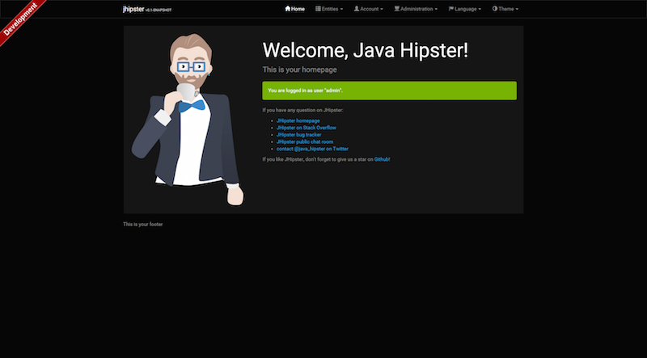
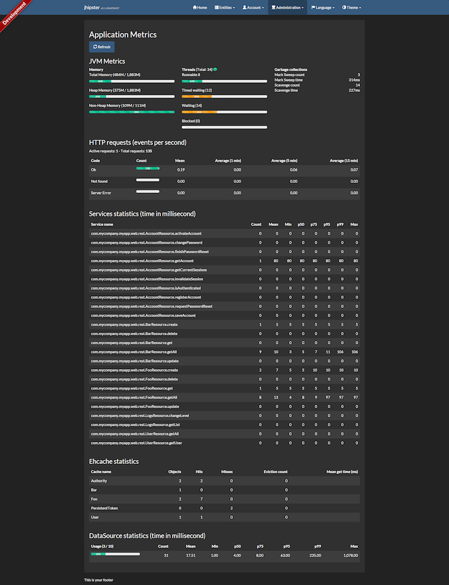

# Using Bootswatch themes with theme switcher

__Tip submitted by [@deepu105](https://github.com/deepu105)__

To have [Bootswatch](https://bootswatch.com/) themes instead of the default theme you just need to override the bootstrap css with the css from bootswatch theme. However if you want a cool theme switcher to switch between Bootswatch themes dynamically then follow this tip.

Make the following changes in the generated app.

**Note:** replace 'yourApp' with the generated name of your application. 

## Add Files

Add the below service as `bootswatch.service.js` under `webapp/components/util`

    'use strict';

    angular.module('yourApp')
        .factory('BootSwatchService', function ($http) {
            return {
                get: function() {
                    return $http.get('http://api.bootswatch.com/3/').then(function (response) {
                        return response.data.themes;
                    });
                }
            };
        });

Add the below directive as `bootswatch.directive.js` under `webapp/components/util`

    'use strict';

    angular.module('yourApp')
        .directive('jhSwitchTheme', function() {
            /*Directive binds to anchor to update the bootswatch theme selected*/
            return {
                restrict: 'A',
                scope: {
                    theme : '=jhSwitchTheme'
                },
                link: function (scope, element, attrs) {
                    var currentTheme = $("#bootswatch-css").attr('title');
                    if(scope.theme.name === currentTheme){
                        element.parent().addClass("active");
                    }

                    element.on('click',function(){
                        $("#bootswatch-css").attr("href", scope.theme.css);
                        $(".theme-link").removeClass("active");
                        element.parent().addClass("active");
                    });
                }
            };
        });

Add the below controller as `bootswatch.controller.js` under `webapp/components/util`

    'use strict';

    angular.module('yourApp')
        .controller('BootswatchController', function ($scope, BootSwatchService) {
            /*Get the list of availabel bootswatch themes*/
            BootSwatchService.get().then(function(themes) {
                $scope.themes = themes;
                $scope.themes.unshift({name:'Default',css:''});
            });
        });

## index.html

Add the below to the index.html file after the CSS build task so that these are not minified and compacted by build task

    <!-- build:css assets/styles/main.css -->

    ...

    <!-- endbuild -->
    <!-- placeholder link to load bootswatch themes, title holds the current applied theme name-->
    <link rel="stylesheet" href="" id="bootswatch-css" title="Default">

Add the below in footer

    

        
This is your footer

        

            <a class="btn btn-default dropdown-toggle" data-toggle="dropdown">
                
                Theme
                <b class="caret"></b>
            </a>
            <ul class="dropdown-menu" role="menu">
                <li class="theme-link" ng-repeat="theme in themes">
                    <a href="" jh-switch-theme="theme">{{theme.name}}</a>
                </li>
            </ul>
        

    

    
Add script tags in your index.html file so you don't receive angular errors

    <!-- build:js({.tmp,src/main/webapp}) scripts/app.js -->
    
    ...
    
    
    
    

# app.js (only for oAuth/xAuth)

Add exclusion to the bootswatch url in authInterceptor in `app.js` if you are using OAuth or XAuth

    .factory('authInterceptor', function ($rootScope, $q, $location, localStorageService) {
        return {
            // Add authorization token to headers
            request: function (config) {
                config.headers = config.headers || {};
                // exclude bootswatch url
                if(config.url.indexOf('api.bootswatch.com') === -1){
                    var token = localStorageService.get('token');
                    ....
                }
                return config;
            }
        };

# Screenshots

